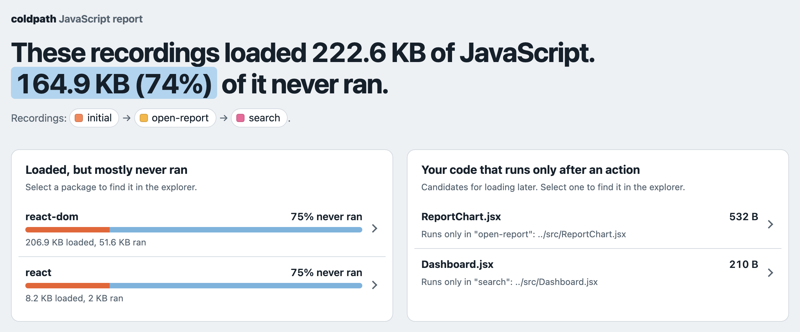
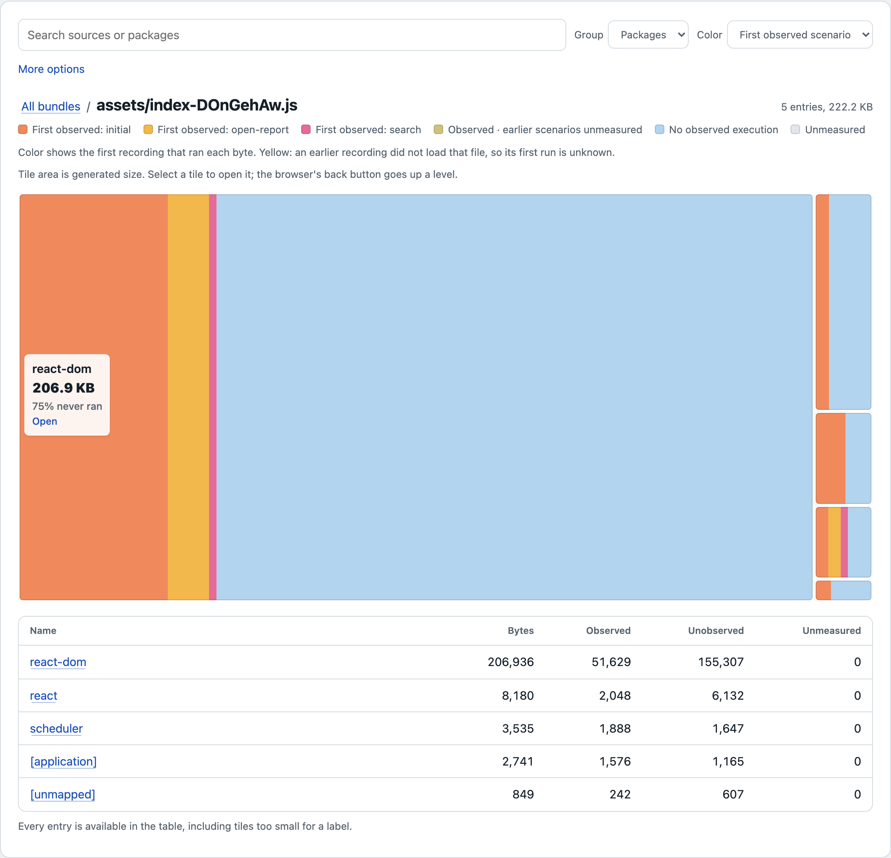
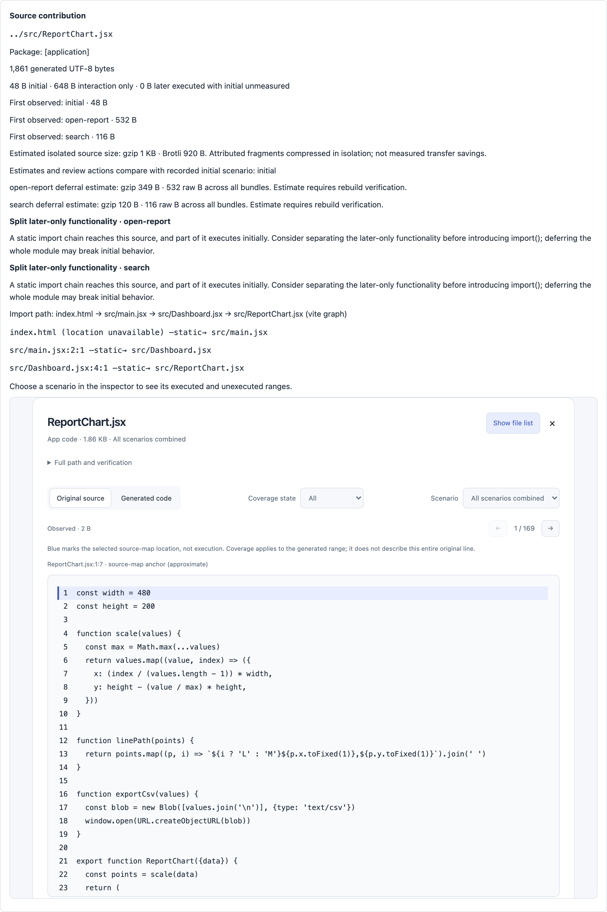
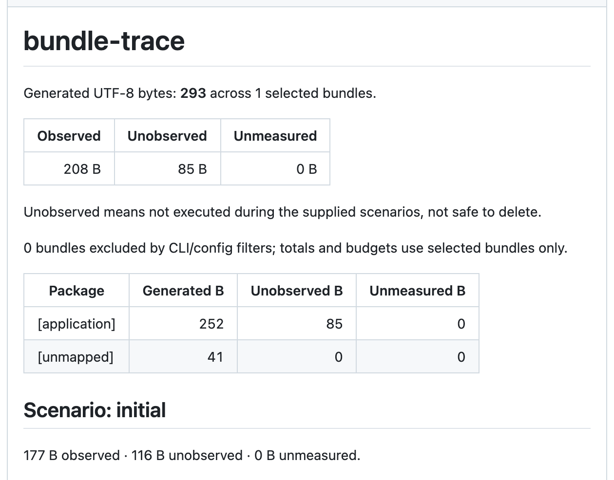

# coldpath

[](https://github.com/yceffort/coldpath/actions/workflows/ci.yml)
[](LICENSE)

See which JavaScript runs initially, which runs only during interactions, and what changed in a pull request—backed by source maps and V8 coverage.

`coldpath` is a Rust CLI. Analysis, compression, and report generation run offline, without Node.js or a browser. Bring an existing Chrome, Playwright, Puppeteer, or Node coverage recording, or use the optional Chromium collector.

- Attribute generated JavaScript to original sources using source maps.
- Keep **observed**, **unobserved**, and **unmeasured** bytes separate.
- Explore bundle/folder/package treemaps, with an optional source-code inspector.
- Color bytes by their first observed scenario; inspect code separately for each recording.
- Compare a baseline by source, package, and scenario; highlight growth and new modules.
- Union recordings from the same build and reject mismatched source evidence.
- Accept files/globs and export HTML, JSON, TSV, and Markdown; enforce byte budgets in CI.
- Trace import chains and available locations from esbuild, webpack, Rollup/Vite, and Next.js Turbopack graphs.
- Review suggested loading boundaries with explicitly estimated source gzip/Brotli sizes.

Early-stage software: the CLI and JSON schema may change. Unobserved bytes are code that did not run during the supplied scenarios; they are not automatically safe to delete.

## Install

Requires Rust 1.88 or newer. Install from GitHub:

```sh
cargo install --git https://github.com/yceffort/coldpath --locked
```

Or build locally:

```sh
git clone https://github.com/yceffort/coldpath.git
cd coldpath
cargo build --locked --release
./target/release/coldpath --help
```

The project is not published to crates.io or npm yet. Node.js is only needed for optional collection, graph export, and integration tests.

### Node package

The repository root is the `coldpath` npm package. It puts the collector, graph export, and analyzer behind one command, and exports `coldpath/rollup`, `coldpath/vite`, and `coldpath/webpack` graph plugins. Collection additionally needs `playwright` in your project.

```sh
coldpath collect --scenarios coldpath.scenarios.json
coldpath analyze --scenarios coldpath.scenarios.json --graph dist/assets/coldpath.graph.json --treemap artifacts/actions.html
```

`coldpath analyze` (or `coldpath` with analyzer options) runs the Rust analyzer from `COLDPATH_ANALYZER`, the `coldpath-<platform>-<arch>` package that `scripts/pack-native.mjs` builds, or the native `coldpath` binary on `PATH` (the npm wrapper skips itself), in that order. See [collecting coverage](docs/collecting.md#scenario-files) for the scenario file.

## Try the recorded example

From a checkout, run this without installing Node.js or Chromium:

```sh
cargo run --locked --release -- \
  --dir examples/recorded \
  --coverage examples/recorded/initial.coverage.json \
  --coverage examples/recorded/interaction.coverage.json \
  --initial-scenario initial \
  --json artifacts/report.json \
  --treemap artifacts/report.html --details
```

Expected totals: **293 bytes**, **208 observed**, **85 unobserved**, **0 unmeasured**. Open `artifacts/report.html` directly in your browser. Colors separate initial and later execution; click a source and select a scenario to inspect its code ranges. Its data, scripts, and styles are embedded; no report server or network requests are needed.

The example contains real V8 coverage, source maps, and multibyte characters. Do not reformat `examples/recorded`: the recordings verify the exact JavaScript and map hashes.

## Walkthrough: find code that only runs after a click

This walkthrough uses [`examples/demo`](examples/demo), a small React dashboard built with Vite. Its "Open report" button renders a chart component that `Dashboard.jsx` imports statically, and its search box loads `search.js` with `import()`. The screenshots below come from exactly these steps.

**1. Emit a dependency graph from your build.** Add the plugin and enable source maps (`vite.config.mjs`):

```js
import coldpathGraph from 'coldpath/vite' // coldpath/rollup and coldpath/webpack also exist

export default {
  plugins: [coldpathGraph()],
  build: {sourcemap: true},
}
```

`vite build` now also writes `dist/coldpath.graph.json`. The graph lets the report explain *why* a module is in the bundle (the import chain and the line of each import).

**2. Describe the scenarios.** A scenario is a page load plus optional Playwright actions. List them in the order a user would encounter them (`coldpath.scenarios.json`):

```json
{
  "url": "http://127.0.0.1:4173/",
  "dir": "dist",
  "out": "artifacts/coverage",
  "scenarios": [
    {"name": "initial"},
    {"name": "open-report", "actions": "scenarios/open-report.mjs"},
    {"name": "search", "actions": "scenarios/search.mjs"}
  ]
}
```

```js
// scenarios/open-report.mjs
export default async function ({page}) {
  await page.getByRole('button', {name: 'Open report'}).click()
  await page.getByRole('img', {name: 'Weekly orders'}).waitFor()
}
```

**3. Serve the build and record each scenario in Chromium.**

```sh
npx vite preview --port 4173 --host 127.0.0.1   # in another terminal
npx coldpath collect --scenarios coldpath.scenarios.json
```

```text
initial: 1 scripts, 2 snapshots -> /path/to/demo/artifacts/coverage/initial.coverage.json
open-report: 1 scripts, 2 snapshots -> /path/to/demo/artifacts/coverage/open-report.coverage.json
search: 2 scripts, 2 snapshots -> /path/to/demo/artifacts/coverage/search.coverage.json
```

Each recording is bound to the exact files in `dist` by SHA-256, so it cannot be applied to a different build by mistake.

**4. Analyze and open the report.**

```sh
npx coldpath analyze --scenarios coldpath.scenarios.json \
  --graph dist/coldpath.graph.json --source-compression --details \
  --treemap artifacts/report.html --markdown artifacts/summary.md
```

```text
Generated UTF-8 bytes: 222552 (2 bundles)
Observed: 57691 | Unobserved: 164861 | Unmeasured: 0
Unobserved means not executed during the supplied scenarios, not safe to delete.

Scenario initial: 43835 observed | 178406 unobserved | 311 unmeasured
Scenario open-report: 55121 observed | 167120 unobserved | 311 unmeasured
Scenario search: 54068 observed | 168484 unobserved | 0 unmeasured
       Bytes     Observed   Unobserved   Unmeasured  Package
      206936        51629       155307            0  react-dom
        8180         2048         6132            0  react
        3535         1888         1647            0  scheduler
        3008         1840         1168            0  [application]
         893          286          607            0  [unmapped]
```

Open `artifacts/report.html` in a browser (it works offline). The top of the report says what matters in plain sentences: how much of the loaded JavaScript never ran, which packages were loaded but mostly never ran, and which of your own files run only after a specific action. Select an entry to find it in the treemap.



Below the summary, files that no recording loaded are hidden (the summary offers to show them), search, grouping, and the color mode sit above the treemap, and the remaining filters live under "More options". Tile area is generated bytes; color is the first scenario that executed those bytes: warm colors for code that ran (orange for the initial load, amber for "open-report", rose for "search") and ice blue for code that no scenario executed. Each tile's label gives its name, size, and the share that never ran. Grouped by package, most of this bundle is `react-dom` code that none of the three scenarios executed:



**5. Follow a review action.** "Review actions" (between the summary and the explorer) lists sources whose bytes first run after the initial load. Selecting `ReportChart.jsx` shows that 48 B of it run on the initial load (its module body) and 532 B run only in "open-report", the static import chain `main.jsx → Dashboard.jsx:4:1 → ReportChart.jsx` that pulls it into the initial bundle, isolated gzip estimates, and a code inspector per scenario:



The action is "split later-only functionality" rather than "defer" because part of the module runs initially; moving the whole import behind `import()` could change initial behavior. `search.js` is already behind a dynamic import, so the report asks you to record it in the initial scenario before drawing conclusions instead of suggesting a change. Estimates are for review, not guaranteed savings: rebuild and record again to measure the result.

**6. Check pull requests in CI.** The [GitHub Action](#github-action) runs the same analysis on the base branch and the pull request, enforces growth budgets, and keeps one comment up to date on the pull request:



To reproduce this walkthrough from a checkout, run `pnpm install --frozen-lockfile`, `pnpm exec playwright install chromium`, and `cargo build --locked --release`, then:

```sh
pnpm exec vite build examples/demo
pnpm exec vite preview examples/demo --port 4173 --host 127.0.0.1   # in another terminal
cd examples/demo
node ../../bin/coldpath.mjs collect --scenarios coldpath.scenarios.json
COLDPATH_ANALYZER=../../target/release/coldpath node ../../bin/coldpath.mjs analyze \
  --scenarios coldpath.scenarios.json --graph dist/coldpath.graph.json \
  --source-compression --details --treemap artifacts/report.html
```

## Analyze your build

For a compact size explorer, pass files or a quoted glob:

```sh
coldpath 'dist/**/*.js' --treemap artifacts/size.html
coldpath dist/app.js dist/app.js.map --json artifacts/size.json
coldpath 'dist/**/*.js' --tsv -
```

Open the HTML directly in your browser. Click bundles and folders to zoom, navigate back with breadcrumbs, search sources, or group by package. Tile area represents bytes; coverage colors distinguish observed, unobserved, and unmeasured code. Every file is available in the table, including small tiles. With file/glob inputs and no output option, the CLI writes `coldpath.html` in the current directory, replacing any existing file, and prints `Wrote coldpath.html` after saving it.

Build your application with source maps and point the CLI at its JavaScript output:

```sh
coldpath --dir dist --compression --html artifacts/bundle.html
```

Without a recording, all bytes are unmeasured. Missing source maps are allowed and remain `[unmapped]`; explicitly referenced missing or invalid maps cause an error.

To add a Chrome Coverage export:

```sh
coldpath --dir dist \
  --coverage chrome-coverage.json \
  --url-prefix https://example.com/assets/ \
  --json artifacts/coverage.json \
  --html artifacts/coverage.html
```

`--url-prefix` maps the URL suffix to a file under the analysis root and must end in `/`. Combine `--dir` with file/glob inputs to keep this root fixed when selecting only part of a build, for example `--dir dist 'dist/assets/*.js'`. Without `--dir`, the common parent of the selected JavaScript files becomes the root. Use repeated `--coverage` arguments to union scenarios from the **same build**. For coverage of unselected files, exact URL mappings, source-map overrides, Playwright inputs, and Node coverage, see the [usage guide](docs/usage.md).

## Understand the numbers

| Field             | Meaning                                                     |
| ----------------- | ----------------------------------------------------------- |
| `bytes`           | Generated, uncompressed UTF-8 bytes                         |
| `observedBytes`   | Bytes in ranges executed in at least one supplied recording |
| `unobservedBytes` | Bytes not executed in a script that has a recording         |
| `unmeasuredBytes` | Bytes in a script with no supplied recording                |

The three states sum to `bytes`. V8 offsets use UTF-16 code units; the analyzer converts them to UTF-8 byte boundaries. These numbers are neither original TypeScript file sizes nor compressed transfer sizes.

Source-map attribution is an estimate: a mapping owns bytes up to the next mapping on the same line or the line's end. Unmapped prefixes, line breaks, and segments without a source remain `[unmapped]`. Original source highlights identify mapping anchors, not exact source-level statement or branch coverage.

`--treemap` exports a compact size/coverage explorer; add `--details` to include its inline code inspector. `--html` exports the full generated/original code inspector. Detailed outputs include source code; summary JSON and default treemaps omit it. Large inspector payloads require a browser with `DecompressionStream` support.

## Find loading boundaries

```sh
coldpath --dir dist \
  --coverage initial.json --coverage open-report.json --coverage search.json \
  --initial-scenario initial --scenario-order initial,open-report,search \
  --graph artifacts/graph.json --graph-root . --source-compression \
  --treemap artifacts/actions.html --details --markdown artifacts/actions.md
```

[Export a graph from your bundler](docs/graphs.md) first. The report distinguishes static-import deferral candidates, sources that need to be split because part executes initially, existing dynamic boundaries, and missing initial measurements. Click a colored tile for import locations, estimates, and scenario-specific code highlights. Estimates compress source fragments in isolation; they are **not guaranteed transfer savings**.

Scenario order is explicit, not inferred from timestamps. Standard coverage exports use filenames as scenario names; hash-bound envelopes use their `scenario` field.

## Collect a browser scenario

The optional collector requires Node.js 24+, Playwright, and Chromium:

```sh
npm install --save-dev playwright
npx playwright install chromium

# Serve the same build locally in another terminal.
coldpath collect \
  --url http://127.0.0.1:3000/ \
  --dir path/to/dist/assets \
  --prefix /assets/ \
  --out artifacts/initial.coverage.json
```

For Next.js, use the build's static output directory with `--prefix /_next/static/`. The collector accepts a local action module for clicks, searches, and other interactions. See [collecting coverage](docs/collecting.md) for the action API, capture scope, and source-map limitations.

## Analyze a site you do not build

Without source maps, `coldpath snapshot` records a deployed page's scripts, coverage, and what caused each script to load; `coldpath modules` recovers webpack module boundaries as synthetic sources; and `coldpath label` asks a language model (Anthropic or any OpenAI-compatible endpoint) to summarize those modules and guess what they are, keeping only guesses whose evidence strings occur in the module and are rare elsewhere. The treemap then groups bundles by load cause and marks guessed names as inferred. See [analyzing a site you do not build](docs/third-party.md).

## Use in CI

```sh
coldpath --dir dist \
  --exclude 'vendor/**' \
  --compression --max-bytes 1000000 \
  --json artifacts/report.json \
  --markdown artifacts/summary.md
```

Exit codes: `0` success, `1` input/analysis error, `2` budget exceeded. Argument syntax errors also use `2` (clap). Reports are written before budget failure. [Configuration](docs/usage.md#filters-compression-and-budgets) also supports observed-scenario coverage budgets and gzip/Brotli budgets.

Compare a PR build against a saved report from main:

```sh
coldpath --dir dist --baseline artifacts/main.json \
  --max-added-bytes 10000 --treemap artifacts/pr.html \
  --json artifacts/pr.json --markdown artifacts/pr.md
```

Use the same analysis-root convention and bundle selection for both builds. Reports use schema version 3 with normalized source paths; regenerate older baselines. Add matching coverage scenarios to compare execution changes, and `--initial-scenario initial --max-added-unobserved-bytes 10000` to budget initial unobserved growth. See [scenario and PR comparisons](docs/usage.md#scenarios-and-execution-phases) for measurement requirements and visual controls.

### GitHub Action

The repository is also a composite action. It builds the analyzer, runs your analyzer options on a checkout of the base branch and on the pull request build, uploads the report JSON, Markdown summary, and HTML treemap as an artifact, and creates or updates a single pull request comment. Budget failures fail the job after the comment is written.

```yaml
permissions:
  contents: read
  pull-requests: write
steps:
  - uses: actions/checkout@v6
  - uses: actions/checkout@v6
    with:
      ref: ${{ github.event.pull_request.base.sha }}
      path: base
  # Build both checkouts and record coverage here.
  - uses: yceffort/coldpath@main
    with:
      base-directory: base
      args: |
        --dir
        dist
        --coverage
        artifacts/initial.coverage.json
        --initial-scenario
        initial
      max-added-bytes: 10000
      max-added-unobserved-bytes: 10000
```

`args` takes one argument per line and must not include output options. Use `baseline` instead of `base-directory` to pass a report you already have, for example one downloaded from the base branch's last run. The comment is found by a marker and must be written by a bot account (the default `GITHUB_TOKEN` is). Pull requests from forks get a read-only token, so the comment step only warns there; the artifact is still uploaded. The runner needs Rust (`cargo`). [`pr-report.yml`](.github/workflows/pr-report.yml) runs the action on this repository's recorded example.

## Development

```sh
cargo fmt --all -- --check
cargo clippy --locked --all-targets -- -D warnings
cargo test --locked

# Optional integration checks with real Chromium and Node coverage:
pnpm install --frozen-lockfile
pnpm exec playwright install chromium
pnpm test:browser
pnpm test:corpus
pnpm test:package
```

CI runs Rust tests on Linux and macOS, checks the minimum Rust version on Linux, and exercises the HTML report, input adapters, collector, and five real bundler builds in Chromium on both platforms. See [CONTRIBUTING.md](CONTRIBUTING.md) for test boundaries and fixtures.

A [reproducible comparison](benchmarks/RESULTS.md) and [explorer measurements](benchmarks/MVP.md) record performance and compatibility on one saved build. These are development measurements, not a general performance ranking or proof of attribution accuracy across bundlers.

## Measured attribution accuracy

The [real-build corpus](docs/accuracy-corpus.md) publishes reference-map agreement, known-origin probe errors, and per-scenario V8 range checks for esbuild, Rollup, Vite, webpack, and Next.js/Turbopack. It includes a negative control that changes source ownership while retaining every byte count.

The current Next.js fixture exposes **22 incorrectly attributed probe bytes out of 67**, caused by source-map anchors inside inlined literals. Agreement with a source map does not prove semantic attribution is correct. These small fixtures do not establish an error rate for arbitrary applications.

## Origin and license

Extracted from an experiment in [yceffort/blog](https://github.com/yceffort/blog). The original repository keeps the blog-specific performance studies and measurement data; this repository maintains the reusable analyzer and collector.

[MIT](LICENSE) © 2026 yceffort.
